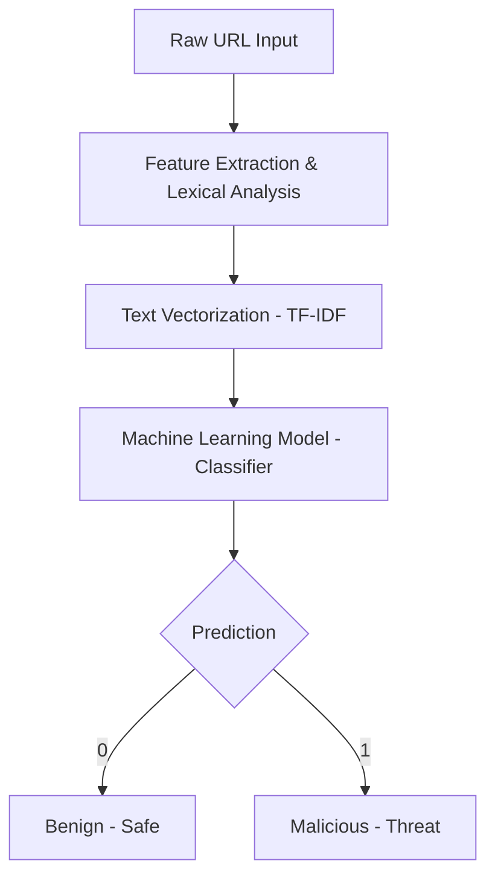

# Background Theory: Malicious URL Detection using Machine Learning

## 1. Introduction to Phishing and Malicious URLs

Phishing is a type of social engineering attack where an attacker sends a deceptive message, often through email, text, or social media, designed to trick a human victim into revealing sensitive information [1]. This information can include login credentials, financial details, or personal identification data. A cornerstone of most phishing attacks is the use of **malicious URLs**—links that appear legitimate but direct the user to a fraudulent website or trigger a malware download.

### Why Malicious URL Detection is Important
Malicious URLs constitute a significant portion of cyber-attacks, accounting for approximately 60% of all online threats [2]. Traditional defense mechanisms, such as blacklisting, involve maintaining a database of known malicious domains. However, attackers can easily bypass these by generating new, unique URLs using techniques like Domain Generation Algorithms (DGA). Therefore, a more proactive and intelligent approach, such as machine learning, is required to identify the underlying patterns of malicious intent within the URL structure itself.

---

## 2. Machine Learning Fundamentals

Machine Learning (ML) is a subset of artificial intelligence that focuses on building systems that can "learn" from data and make predictions or decisions without being explicitly programmed for every scenario [3].

### Supervised Learning and Classification
In this project, we employ **Supervised Learning**, a paradigm where the model is trained on a labeled dataset. Specifically, we treat malicious URL detection as a **Classification** problem. The goal is to categorize each input URL into one of two discrete classes:
*   **Benign (0)**: Safe, legitimate URLs.
*   **Malicious (1)**: Harmful URLs (phishing, malware, etc.).

### Features and Labels
*   **Labels**: These are the "ground truth" values we want the model to predict (e.g., "Malicious" or "Benign").
*   **Features**: These are the individual measurable properties or characteristics of the data that the model uses to make its prediction. For URLs, features are extracted from the string's structure and content.

### Training vs. Testing
To build a reliable model, the dataset is typically split into two parts:
1.  **Training Set**: Used to "teach" the model by showing it many examples of URLs and their corresponding labels. The model adjusts its internal parameters to minimize prediction errors.
2.  **Testing Set**: A separate portion of the data that the model has never seen before. It is used to evaluate the model's performance and ensure it can generalize to new, real-world data.

---

## 3. URL Structure and Feature Engineering

Understanding how URLs are structured is vital for extracting meaningful features that differentiate benign links from malicious ones.

### URL Anatomy
According to RFC 3986, a standard URL follows a specific hierarchy [4]:
`scheme://authority/path?query#fragment`
*   **Scheme**: The protocol used (e.g., `http`, `https`).
*   **Authority (Domain/Host)**: The primary address of the website (e.g., `google.com`).
*   **Path**: The specific resource or page on the server (e.g., `/login`).
*   **Query**: Parameters passed to the resource (e.g., `?user_id=123`).

### Lexical Feature Extraction
Attackers often create recognizable patterns in their URLs to deceive users or bypass filters. By putting a URL "under a microscope," we can extract **lexical features** such as:
*   **Length-based features**: Malicious URLs are often unusually long or contain many subdomains.
*   **Character counts**: Frequent use of special characters like `@`, `-`, `_`, `.`, and `?` can be indicative of suspicious activity.
*   **Presence of IP Address**: Legitimate sites rarely use raw IP addresses (e.g., `192.168.1.1`) in their URLs.
*   **Shortening Services**: Attackers frequently use services like `bit.ly` or `tinyurl.com` to hide the true destination of a malicious link.

---

## 4. Text Processing and Vectorization

Machine learning models require numerical input. Since URLs are raw text strings, we must transform them using Natural Language Processing (NLP) techniques.

### Tokenization and N-Grams
*   **Tokenization**: The process of breaking a URL string into smaller units called "tokens." These can be individual characters or segments separated by delimiters like `/` or `.`.
*   **N-Grams**: A contiguous sequence of *n* items from a given sample of text. For example, character-level trigrams (*n=3*) for the word "safe" would be "saf" and "afe". Using N-grams allows the model to capture the structural context of the URL.

### Vectorization: TF-IDF vs. CountVectorizer
*   **CountVectorizer**: A simple method that converts text into a matrix of token counts. It simply counts how many times each token appears in a URL.
*   **TF-IDF (Term Frequency-Inverse Document Frequency)**: A more advanced technique that reflects how important a token is to a specific URL relative to the entire dataset [5]. It rewards tokens that are frequent in a specific URL but rare across the whole dataset, helping to filter out common, non-informative tokens like `www` or `com`.

---

## 5. Project Pipeline

The overall workflow for the Malicious URL Detector follows a structured pipeline:

| Step | Description |
| :--- | :--- |
| **Data Collection** | Gathering a large, balanced dataset of labeled benign and malicious URLs. |
| **Preprocessing** | Cleaning the data and handling missing values or duplicates. |
| **Feature Extraction** | Analyzing the URL structure to generate lexical and N-gram features. |
| **Vectorization** | Converting the extracted features into numerical vectors using TF-IDF. |
| **Model Training** | Training a classifier (e.g., Random Forest or SVM) on the vectorized data. |
| **Evaluation** | Testing the model on unseen data using metrics like Accuracy and F1-score. |
| **Deployment** | Integrating the trained model into a user-friendly web interface. |

### High-Level Workflow Diagram

---

## References
[1] OWASP Foundation, "Phishing Attack," [Online]. Available: https://owasp.org/www-community/attacks/Phishing.
[2] V. Lakhwara et al., "Detecting Malicious URLs: A comprehensive guide using ML and NLP Techniques," Medium, 2022.
[3] IBM, "What is Machine Learning?" [Online]. Available: https://www.ibm.com/topics/machine-learning.
[4] Python Documentation, "urllib.parse — Parse URLs into components," [Online]. Available: https://docs.python.org/3/library/urllib.parse.html.
[5] Scikit-learn, "TfidfVectorizer Documentation," [Online]. Available: https://scikit-learn.org/stable/modules/generated/sklearn.feature_extraction.text.TfidfVectorizer.html.

## Additional Theoretical Concepts from Day 1 Guide

### Key Concepts in Malicious URL Detection

*   **Lexical Features**: These are characteristics extracted directly from the URL string itself. Examples include: Length of the URL, number of specific characters (e.g., dots `.`, hyphens `-`, slashes `/`, question marks `?`, equals signs `=`), presence of an IP address instead of a domain name, and use of URL shortening services.
*   **N-Gram Model**: A technique used in natural language processing (NLP) to break down text (in our case, URL strings) into contiguous sequences of 'n' items (characters or words). This helps capture patterns that indicate malicious intent.
*   **Tokenization**: The process of breaking down a URL string into smaller, meaningful units called "tokens." These tokens can be individual characters, words, or N-grams.
*   **Vectorization**: Machine learning models cannot directly process raw text. Vectorization converts these tokens into numerical representations (vectors) that the models can understand. Techniques like TF-IDF (Term Frequency-Inverse Document Frequency) or CountVectorizer are commonly used for this.
*   **Classification Models**: Algorithms like Support Vector Machines (SVMs), Logistic Regression, or Random Forests are trained on a dataset of known benign and malicious URLs. They learn patterns from the vectorized features to predict the class of new, unseen URLs.

**In essence, the process involves:**
1.  **Extracting features** from the URL (e.g., length, special characters, N-grams).
2.  **Converting these features into numerical vectors**.
3.  **Training a machine learning model** on these vectors and their corresponding labels (benign/malicious).
4.  **Using the trained model** to predict whether a new URL is benign or malicious.

## Additional Theoretical Concepts from Day 3 Guide

### Lexical Feature Extraction
Lexical features are often strong indicators of malicious intent. For example, attackers frequently use long URLs to hide the actual destination or use special characters like `@` to spoof legitimate domains.

**Key Lexical Features:**
*   **URL Length**: Malicious URLs tend to be longer than benign ones.
*   **Special Character Counts**: We count occurrences of `.`, `-`, `_`, `/`, `?`, `=`, `@`, and `&`.
*   **IP Address Presence**: Detecting if the URL uses a raw IP address instead of a domain name.
*   **HTTPS Status**: Checking if the URL uses the secure `https` protocol.

### Custom Tokenization & TF-IDF
Standard text tokenizers (like those used for English sentences) are not ideal for URLs. Following the best practices from the `jivoi/awesome-ml-for-cybersecurity` repository, we implemented a custom tokenizer.

**The Custom Tokenizer:**
Our tokenizer splits URLs by common delimiters: `/`, `-`, and `.`. It also filters out non-informative tokens like `www` and `com`. This helps the model focus on meaningful segments like `wp-admin`, `login`, or `virus`.

**TF-IDF Vectorization:**
We use **TF-IDF (Term Frequency-Inverse Document Frequency)** to vectorize these tokens. TF-IDF is superior to simple counting because it rewards tokens that are frequent in a specific URL but rare across the entire dataset, effectively highlighting suspicious "keywords."
